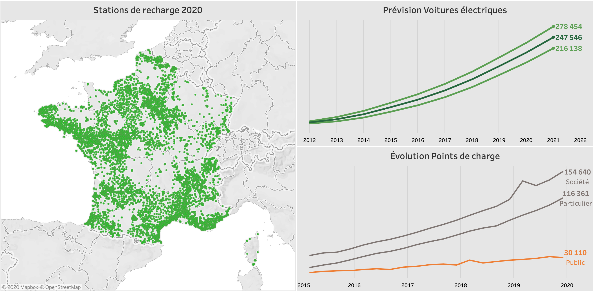

# Projet : 2040 le cap des 100% de voitures électriques
### Projet du parcours de formation Data Analyst OpenClassrooms réalisé en partenariat avec l’ENSAE-ENSAI.
L'évolution du parc automobile français depuis 2010 prévisions sur les prochaines années. Un tour complet en trois volets: véhicules, stations de recharge, et distribution d'électricité.


## Tableaux de bord
Rendez-vous sur [Tableau Public](https://public.tableau.com/profile/nalron#!/vizhome/ElectricCarsFrance2040/Vuedensemble) pour l'accès aux tableaux de bord intéractifs.



## Préambule
Pour ce projet, les données ont été manipulées en Python sur support Jupyter Notebook avec visualisation via Tableau Software.

### Les données
 - Données des immatriculations des véhicules : [statistiques.developpement-durable.gouv.fr](https://www.statistiques.developpement-durable.gouv.fr/donnees-sur-les-immatriculations-des-vehicules)
 - Tableau comparatif des voitures électriques : [fiches-auto.fr](http://www.fiches-auto.fr/articles-auto/electrique/s-852-comparatif-des-voitures-electriques.php)
 - Données des bornes de recharge pour véhicules électriques (IRVE) : [data.gouv.fr](https://www.data.gouv.fr/fr/datasets/fichier-consolide-des-bornes-de-recharge-pour-vehicules-electriques/)
 - Données des points de charge par typologie : [data.enedis.fr](https://data.enedis.fr/explore/dataset/nombre-de-points-de-charge-par-typologie/information/)
 - Parc des installations de production raccordées par departement : [data.enedis.fr](https://data.enedis.fr/explore/dataset/parc-des-installations-de-production-raccordees-par-departement/information/?disjunctive.type_injection)
 - Données en puissance sur la consommation et production par filière d'énergie : [rte-france.com](https://www.rte-france.com/fr/eco2mix/eco2mix-telechargement)

### Compétences évaluées
 - Réaliser un projet libre à caractère social (proposition d'un plan, d'une méthode, de données, …)
 - Rédaction d'un rapport d'analyse statistique
 - Communiquer ses résultats à l’aide de visualisations (Tableau software)

## Prérequis techniques
Si vous n'avez jamais installé **Python**, alors autant installer directement la **distribution Anaconda**.
Anaconda est donc une distribution Python, faite pour la Data Science.

De cette manière on peut installer Python et ses librairies de Data Science Pandas, Matplotlib, Seaborn, Scipy, Numpy etc… 
Mais aussi le notebook Jupyter, qui reste incontournable et vivement recommandé!
C'est par ici : [Anaconda](https://www.anaconda.com/download)

Si vous souhaitez lancer le projet, il sera nécessaire d'installer Jupyter Notebook sur votre mahcine. 
La doc. Jupyter est accessible via : [Jupyter Documentation](https://jupyter.readthedocs.io/en/latest/install.html) 

```
python -m pip install --upgrade pip    
python -m pip install jupyter
```

Pour tester l'installation, vous pouvez taper dans votre console la commande suivante :

```
jupyter notebook
```

### Installation des librairies Python uniquement
*Pour installer python ainsi que les librairies de Data Science, il est fortement recommandé d'installer la distribution Anaconda.* 

```
pip install pandas
pip install matplotlib
pip install numpy
pip install scipy
```

## Auteur

**Nalron** *(Nicolas Pasero)* - *Initial work* - [Github Nalron](https://github.com/nalron)
